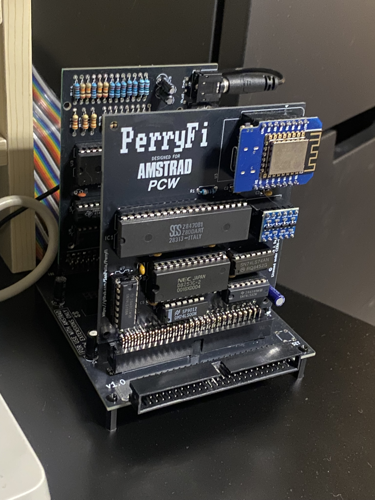
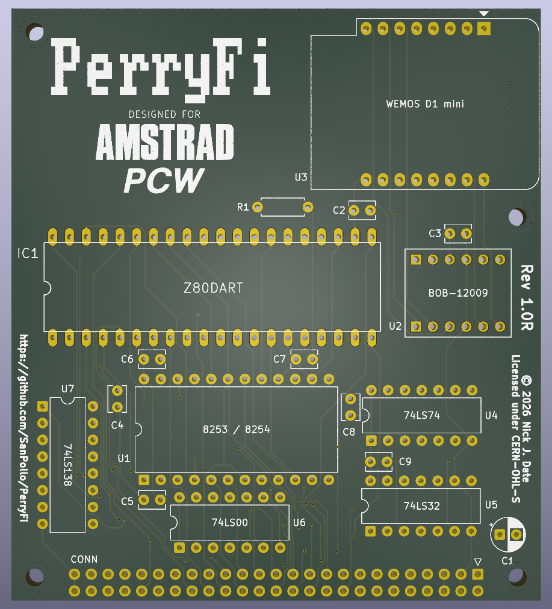
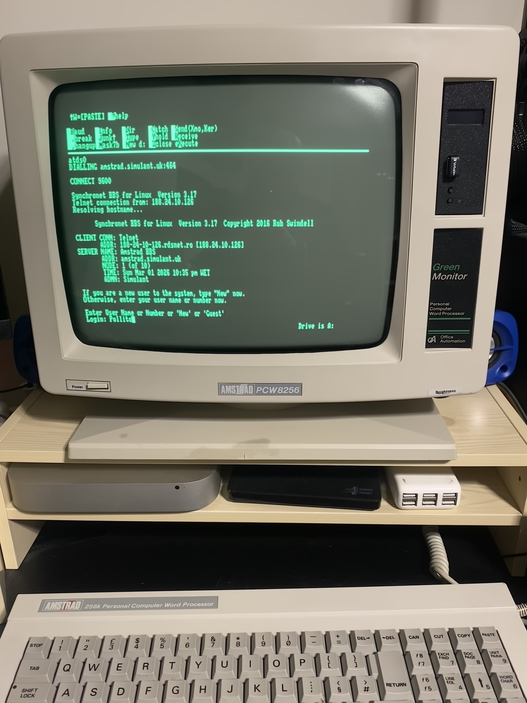

# PerryFi

1. [Introduction](#introduction)
2. [Licences](#licences)
3. [Obtaining the PCB](#obtaining-the-pcb)
4. [BOM](#bom)
5. [Connector](#connector)
6. [Flashing the ESP8266](#flashing-the-esp8266)
7. [PerryFi Configuration](#perryfi-configuration)
8. [Command Reference](#command-reference)
9. [Included Software](#included-software)
10. [Building QTERM](#building-qterm)

 

## Introduction

PerryFi is a wifi modem expansion for Amstrad PCW computers. It is a PCB based on [VapourSoft](https://github.com/VapourSoft)'s [PCW WiFi Modem](https://github.com/VapourSoft/PCWWiFiModem) schematic. The PCW WiFI Modem itself is a fork of [Retro WiFi Modem](https://github.com/mecparts/RetroWiFiModem) by [mecparts](https://github.com/mecparts), who in turn cites inspiration from a [message thread](https://forum.vcfed.org/index.php?threads/wifi232s-evil-clone.1070412/) on the VCF forums, Paul Rickards's [WiFi232](https://biosrhythm.com/?page_id=1453), and Daniel Jameson's [Virtual Modem for ESP8266](https://github.com/stardot/esp8266_modem).

The PCW does not contain the electronics for an RS232 serial port built in, and required a [CPS8256 serial interface](https://www.cpcwiki.eu/index.php/Amstrad_Serial_Interface#Schematic_and_More_.28CPS8256.29) to connect to an analogue modem or serial printer.

The PerryFi combines a serial interface with an [ESP8266 microcontroller](https://en.wikipedia.org/wiki/ESP8266). The ESP8266 is perfect for this task, as it has a built in TCP/IP network stack, wifi connectivity, and its default firmware uses Hayes modem-style AT commands.

PerryFi is designed to either plug into the [PCW Backplane](https://github.com/SanPollo/PCWBackplane), or directly into the back of the PCW using the expansion edge connector. Please check the [Connector](#connector) section for more information.

[Index](#perryfi)

 

## Licences

The licence details for each part of this project are in their respective subdirectories, in a file called LICENSE.md, where this has been possible to determine.

Both VapourSoft's PCW WiFi Modem schematic, and the mecparts's Retro WiFi Modem firmware for the ESP8266 are both licensed under the terms of the [GNU General Public License v3.0](https://www.gnu.org/licenses/gpl-3.0.html), so please check this before modifying or redistributing.

The older CP/M utilities included are believed to be public domain.

The PerryFi PCB is licensed under the [CERN Open Hardware Licence Version 2: CERN-OHL-S](https://opensource.org/license/cern-ohl-s), as is the rest of the content in this repo. Please make sure you read and understand the terms of this licence if you plan to build, sell or release modified versions of the PerryFi.

[Index](#perryfi)

 

## Obtaining the PCB

You can either order this directly from its project page on PCBWay, or from [downloading the gerbers](gerbers/PerryFiV1.0R.zip), and uploading them to your favourite PCB manufacturer. I highly recommend JLCPCB.

[Index](#perryfi)

 

## BOM

| Ref | Qty | Part | Source |
| --- | --- | ---- | ------ |
| C1 | 1 | 22uF 16V Electrolytical Capacitor | [Mouser](https://www.mouser.co.uk/ProductDetail/Wurth-Elektronik/860010372002?qs=0KOYDY2FL2%252B9WwJ0SbWRgQ%3D%3D) |
| C2 - C9 | 8 | 0.1uF / 100 nF (104) Ceramic Capacitor | [Mouser](https://www.mouser.co.uk/ProductDetail/Vishay-BC-Components/K104K15X7RF5UL2?qs=rLgk8CAOBHbCqsnkGO2HJA%3D%3D) |
| CONN | 1** | 2x25-pin 90-deg Keyed Male Box Header **OR**  | [AliExpress](https://www.aliexpress.com/w/wholesale-50-pin-2.54mm-male-connector-right-angle.html) |
|  |  | 50-pin Female Edge Connector | [AliExpress](https://www.aliexpress.com/w/wholesale-50-pin-edge-connector.html) |
| IC1 | 1*** | Z80 DART | [eBay](https://www.ebay.co.uk/sch/i.html?_nkw=z80+dart&_sacat=0&_from=R40&LH_BIN=1&_sop=15) |
| R1 | 1 | 3k3 Resistor | [Mouser](https://www.mouser.co.uk/ProductDetail/Vishay-BC-Components/PR01000103301FA500?qs=doiCPypUmgFDZqxdWEJBZg%3D%3D) |
| SKT IC1 | 1 | 40-pin IC DIP Socket | [Mouser](https://www.mouser.co.uk/ProductDetail/Adam-Tech/ICS-640-T?qs=FG09h9tFCuAGM0DRDA70YA%3D%3D) |
| SKT U1 | 1 | 24-pin IC DIP Socket | [Mouser](https://www.mouser.co.uk/ProductDetail/TE-Connectivity/1-2199298-8?qs=fK8dlpkaUMsSY7Gqcrol0Q%3D%3D) |
| SKT U2 | 2* | 6-pin SIL PIN Socket | [Mouser](https://www.mouser.co.uk/ProductDetail/Adam-Tech/RS1-06-G?qs=HoCaDK9Nz5d%2FRbTZEteJ%252Bw%3D%3D) |
| SKT U3 | 2 | 8-pin SIL PIN Socket | [Mouser](https://www.mouser.co.uk/ProductDetail/Adam-Tech/RS1-08-G?qs=ogqIPVdloe88tnZzSgEOEg%3D%3D) |
| SKT U4 - U6 | 3* | 14-pin IC DIP Socket | [Mouser](https://www.mouser.co.uk/ProductDetail/TE-Connectivity/1-2199298-3?qs=fK8dlpkaUMtBOtVI99wRlQ%3D%3D) |
| SKT U7 | 1* | 16-pin DIP Socket | [Mouser](https://www.mouser.co.uk/ProductDetail/TE-Connectivity/1-2199298-4?qs=fK8dlpkaUMvpL10rY9Abiw%3D%3D) |
| U1 | 1 | 8253 / 8254 Programmable Interval Timer | [eBay](https://www.ebay.co.uk/sch/i.html?_nkw=8253+timer&_sacat=0&_from=R40&LH_BIN=1&_sop=15) |
| U2 | 1 | BOB-12009 3.3 to 5v Bidirectional Logic Converter | [Mouser](https://www.mouser.co.uk/ProductDetail/SparkFun/BOB-12009?qs=WyAARYrbSnb%252BGYLWggQnjQ%3D%3D) |
| U3 | 1 | WEMOS D1 mini | [AliExpress](https://www.aliexpress.com/w/wholesale-wemos-d1-mini.html?spm=a2g0o.home.search.0) |
| U4 | 1 | 74LS74 | [Mouser](https://www.mouser.co.uk/ProductDetail/Texas-Instruments/SN74LS74AN?qs=b0gIXGU74fP41yYZQO4%252BKQ%3D%3D) |
| U5 | 1 | 74LS32 | [Mouser](https://www.mouser.co.uk/ProductDetail/Texas-Instruments/SN74LS32N?qs=q2XTDbzbm6DA9Mnew5GiLA%3D%3D) |
| U6 | 1 | 74LS00 | [Mouser](https://www.mouser.co.uk/ProductDetail/Texas-Instruments/SN74LS00N?qs=spW5eSrOWB6G5wECF%252BEZFA%3D%3D) |
| U7 | 1 | 74LS138 | [Mouser](https://www.mouser.co.uk/ProductDetail/Texas-Instruments/SN74LS138N?qs=j01uVdFEFjG9iU5k7BL8mw%3D%3D) |

\* Optional.

** See [Connector](#connector) section below.

\*** Make sure you order a **Z80 DART** and not a Z80 CPU, or Z80-PIO.

For the two vintage chips, IC1 and U1, to avoid fake vintage chips, I highly recommend buying from a European seller on eBay.

Please note that the **Sources** I have specified are based on research I did after assembling my prototypes, and are there for your convenience. Double-check each component before ordering, and let me know if there are any issues, or if the links were useful by raising an issue.

[Index](#perryfi)

 

## Connector

PerryFi can either be connected to the PCW using a [PCW Backplane](https://github.com/SanPollo/PCWBackplane), or directly with an edge connector.

Note, if you are using the backplane, that the connector will be mounted on the very edge of the PerryFi board. Therefore, it is not possible to solder it flush to the board unless you use something like Blu Tac to raise it up a little.

### PCW Backplane

For use with the PCW Backplane, fit the 90-degree box header to the component side of the board.

### Edge Connector

Note that PerryFi has not yet been tested directly connected to the expansion port, so if you do this, and have confirmed that there are no issues, please log an [issue](issues/) so I can update this documentation.

If you decide to using an edge connector, the connector must be mounted on the **reverse side** of the PCB, with the component side facing outwards.

The PerryFi then fits to the expansion port, as you look at it from the rear of the PCW, so that the WeMos D1 mini is on the top left facing you, and the edge connector is on right hand side, underneath the board.

[Index](#perryfi)

 

## Flashing the ESP8266

The ESP8266 microcontroller on the WEMOS D1 mini needs to be flashed with the correct firmware. All that is required is a USB-A to USB-C data cable (or USB-A to Micro-USB depending on the WEMOS D1 mini clone you bought). Be aware that many of these cables are designed for power only, and do not have their data lines attached. If your computer is unable to see the ESP8266, try another cable.

There is various different ESP8266 firmware to choose from. However, different firmware uses different AT commands, which may break compatibility with existing utilities.

The included firmware was modified from the Retro WiFi Modem project by VapourWare, and has been tweaked slightly by me.

The instructions below only relate to Windows users, and are guidelines only. If you have trouble getting your computer to see the ESP8266, please search the internet for further help.

### Included Firmware

The easiest way to flash the included firmware to the D1 mini's ESP8266 is with the [ESP Easy Flasher](https://github.com/raomin/ESPEasyFlasher) software as you don't need to know the starting address, only the COM port number, and the file name of the firmware.

1. Unplug the PerryFi from the PCW or, preferably, remove the WEMOS D1 mini from the PerryFi.
2. If your D1 mini uses a CH340 for serial, download and install the [CH340 driver](https://www.wch-ic.com/downloads/CH341SER_ZIP.html) before proceeding.
3. Connect the D1 mini into your Windows computer using the relevant USB cable.
4. Right-click on the **Start** menu button, and choose **Device Manager**
5. Expand the **Ports (COM & LPT)** section and look for **DEVICE NAME**. Make a note the COM port number e.g. **COM3**
6. Download the latest version of the ESP Easy Flasher software [from here](https://github.com/raomin/ESPEasyFlasher/releases), and extract it somewhere you can find it.
7. Download the [firmware from here](firmware/perryfi.bin), and put it in the same folder you extracted ESP Easy Flasher.
8. Run **FlashESP8266.exe** from the same folder, and choose the COM port number from step 3, and the **firmware.bin** file.
9. Click **Upload to ESP**.

### Building the Firmware

You may wish to tweak the firmware, for example to change the default baud rate, or even to develop it further.

To do this, you will need the project in the [src/RetroWiFiModem](src/RetroWiFiModem) directory, the [latest version of the Arduino IDE](https://downloads.arduino.cc/arduino-ide/arduino-ide_latest_Windows_64bit.exe), and the [ESP_EEPROM library](https://github.com/jwrw/ESP_EEPROM/releases).

Beyond this, it is out of the scope of this documentation. If you need further assistance, please use the [Arduino forum](https://forum.arduino.cc/).

[Index](#perryfi)

 

## PerryFi Configuration

To get started, download the [included DSK image](software/perryfi.dsk) and copy the image to your [Gotek](https://github.com/SanPollo/PCWGotekMod). Simply boot from your usual DSK image, switch to the floppy and run **QTERM5F.COM**

The default baud rate for the PerryFi is 9600, and the version of QTerm on the DSK is already set to default to this.

### Connect to your Wifi Network

The PerryFi uses [Hayes-style AT commands](https://en.wikipedia.org/wiki/Hayes_AT_command_set), like an original analogue modem.

First, we give the PerryFi the name by which it will be known on your wifi network. For example, `pcw8256` or `joyce`:

`AT$MDNS=pcw8256`

Next, we tell the device the name of your wifi network:

`AT$SSID=yourwifinetwork`

Then the wifi password:

`AT$PASS=wifinetworkpassword`

Now we bring the connection online:

`ATC1`

Assuming the connection is successful, save your settings to the PerryFi. You should do this every time you change a setting you want to keep, or it will be reverted the next time the PerryFi is rebooted:

`AT&W`

### Test Your Connection

To check everything is working fine, we connect to the [Amstrad BBS](https://amstrad.simulant.uk/) hosted by Simulant.

If you check the BBS page above, you will see that the hostname is `amstrad.simulant.net`, and telnet is listening on port **464**. Therefore, we enter the following command:

`ATDTamstrad.simulant.uk:464`

After a few seconds you should see the welcome page.

At this point, feel free to explore the BBS. If not, simply hang up the connection like so:

`+++ATH`

Note that this can be used at any time when you are connected to a remote computer to drop the connection.

[Index](#perryfi)

 

## Command Reference

For a complete list of AT commands, including more settings, [check the list](https://github.com/mecparts/RetroWiFiModem#command-reference) on the original mecparts GitHub repo.

[Index](#perryfi)

 

## Included Software

The DSK image contains a selection of comms-related software to get you started.

It is beyond the scope of this documentation to describe how each piece of software works. However, I highly recommend [following the guide](https://github.com/VapourSoft/PCWWiFiModem/wiki/NIST-Internet-Time-Service-(ITS)) for setting your PCW's time and date from the internet using NIST on VapourSoft's excellent [PCWWiFIModem wiki](https://github.com/VapourSoft/PCWWiFiModem/wiki).

[Index](#perryfi)

 

## Building QTERM

You may wish to build QTERM yourself if you want to change one or more of the default options.

To do this, refer to the instructions in [src/qterm5ae/files/#_READ.ME](src/qterm5ae/files/#_READ.ME)

I recommend using an emulator such as John Elliot's [JOYCE](https://www.seasip.info/Unix/Joyce/), and a tool such as [CIFE](https://github.com/ProgrammingHobby/Cife) to transfer files to and from DSK images.

[Index](#perryfi)